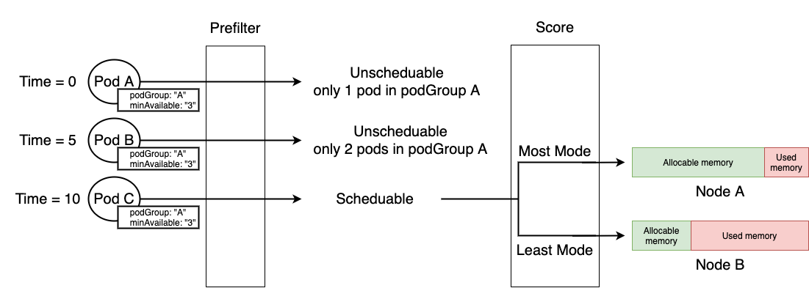

# Scheduler Plugin
## Goal
In this assignment, you are asked to implement a custom Kubernetes scheduler and learn the following skills:
- Use kind to create your own Kubernetes cluster.
- Get familiar with the scheduling framework and design a custom scheduler.
- Write your own Pod spec to validate the implementation.

## Problem Description
We are going to implement a custom scheduler following the scheduling framework. The custom scheduler schedules pods according to the rules below:

1. Pods have labels, groupName and minAvailable. groupName indicates which group the pod belongs to. The custom scheduler schedules the pod only when the number of pods in that group >= minAvailable. You can assume that pods with the same podGroup settings will have the same minAvailable.
2. The scheduler assigns the pod to the node with the least allocatable memory(Least Mode) or the most allocatable memory(Most Mode) according to the configuration of the scheduler.

The figure below illustrates how the custom scheduler manipulates the pods. At time 0, pod A is submitted, but it is unschedulable. That’s because pod A belongs to group A, and pods in group A can’t be scheduled until the pod number within the group is more than 3. At time 5, pod B can’t be scheduled either. At time 10, pod C is not filtered out by the custom scheduler and can be scheduled because the pod in group A is more than three(pod A, pod B, and pod C). Next, pod C is passed to the score function. If the custom scheduler is configured as “Most Mode”, the node with the most allocable memory, which is node A, will be selected. On the other hand, if the custom scheduler is configured as “Least Mode”, Node B will be selected. 



Tag “TODO” is the place you need to implement, which includes PreFilter(), Score(), and NormalizeScore().

## Commands
- work on your scheduler
    ```
    docker build -t my-scheduler:build -f Dockerfile-build .
    docker run -it --rm -v $(pwd):/go/src/app my-scheduler:build
    make
    ```
- run the unit test
    ```
    docker run -it --rm -v $(pwd):/go/src/app my-scheduler:build
    go test -v ./...
    ```
- deploy the scheduler
    ```
    make buildLocal
    make loadImage
    make deploy
    ```
- remove the scheduler
    ```
    make remove
    ```

## Reference
- [Scheduling Framework](https://kubernetes.io/docs/concepts/scheduling-eviction/scheduling-framework/)
- [Scheduler Plugins](https://github.com/kubernetes-sigs/scheduler-plugins)
